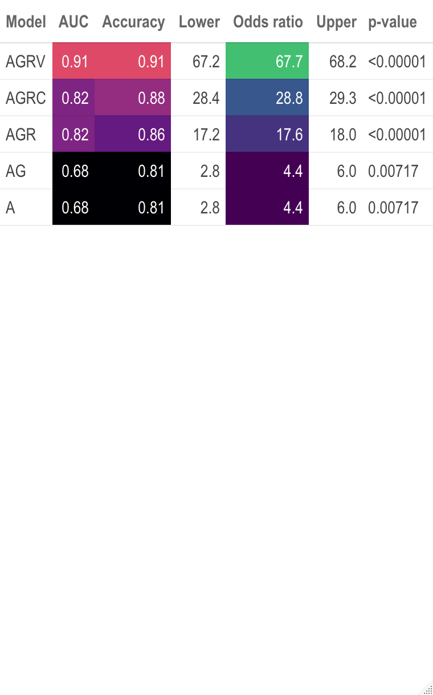

```{r setup, include=FALSE}
library(xaringanExtra)
xaringanExtra::use_panelset()

knitr::opts_chunk$set(echo = FALSE, message = FALSE, warning = FALSE)

```

class: title-slide, right, middle
background-image: url("https://www.statnews.com/wp-content/uploads/2020/02/Coronavirus-CDC-645x645.jpg")
background-position: left
background-size: contain

.pull-right[

# `r rmarkdown::metadata$title`

## `r rmarkdown::metadata$subtitle`

### `r rmarkdown::metadata$author`

### `r Sys.Date()`
]


---
name: intro
class: middle, center

### `r rmarkdown::metadata$author`


### `r rmarkdown::metadata$role`

### `r rmarkdown::metadata$company`

[`r fontawesome::fa("github")` @mskar](https://github.com/mskar)

[`r fontawesome::fa("linkedin")` @mskar](https://linkedin.com/in/mskar)

[`r fontawesome::fa("link")` mskar.github.io](https://mskar.github.io)

---
class: top

# Resources

.pull-left[
- [`r fontawesome::fa("github")` Manuscript repo](https://github.com/Digital-Biobank/covid_variant_severity)
- [`r fontawesome::fa("github")` Slides repo](https://github.com/mskar/aws)
- [`r fontawesome::fa("film")` Live slides](https://mskar.github.io/aws)


]

.pull-right[

]

---
class: middle, inverse

# Timeline

.pull-left[
<br>
- 2020-08: Start
- 2020-12: Manuscript posted`r emo::ji("popper")`
- 2020-12: Manuscript submitted
- 2021-02: Review 1
- 2021-04: Review 2
- 2021-06: Manuscript accepted`r emo::ji("confetti")`
- 2021-11: Follow-up manuscript posted
]


.pull-right[
 

]

---
background-color: white
background-image: url(images/s1.png)
background-size: contain
class: top, center

# Study design


---
background-image: url("images/flow-chart1.png")
background-size: 550px
background-position: left bottom
class: top
background-color: white

# Data pipeline

.pull-right[

- Obtain viral sequences from GISAID
- Call and annotate variants
- Standardize patient metadata
- Combine
    - Annotated variants
    - Patient metadata


]


---
class: top, center, inverse

# Patient outcomes


---
background-color: white
class: top, center

## Figure 1A: Probability of association with severe outcome across SARS-CoV-2 genome


---
background-color: white
class: top, center

## Table 1: Highest and lowest severe outcome association odds ratios


---
class: top, center, inverse

## Figure 1B: Odds ratios of severe versus mild outcome across SARS-CoV-2 genome


---
class: top, center, inverse

## Figure 1C: Odds ratios of severe versus mild outcome across variant frequency


---
class: top, center,
background-color: white

## Figure 2: Nested model ROC curve


---
background-color: white
class: top, center

## Table 2: Nested model performance assessment



---
class: top, center, inverse

## Figure S5: Logistic regression model learning curve


---
background-color: white
background-image: url("images/flow-chart2.png")
background-size: 650px
background-position: left


## Follow-up study

.pull-right[
- Demonstrated utility of the severity model in a new dataset
- Included clinically-derived PCR measurements of viral load
- Patients (n=716)
  - with predicted severity score > 0.5
  - had higher viral load (p=0.0017)
]

---
name: goodbye
class: middle

.pull-left[
### Sincere thanks
to my co-authors:
+ Jameson D. Voss
+ Erin M. McAuley
+ Ezekiel J. Maier
+ Thomas Gibbons
+ Anthony C. Fries
+ Richard R. Chapleau
]


.pull-right[
.right[


# Thank you!

Please feel free to reach out...

[`r fontawesome::fa("github")` @mskar](https://github.com/mskar)

[`r fontawesome::fa("linkedin")` @mskar](https://linkedin.com/in/mskar)

[`r fontawesome::fa("link")` mskar.github.io](https://mskar.github.io)
]
]

